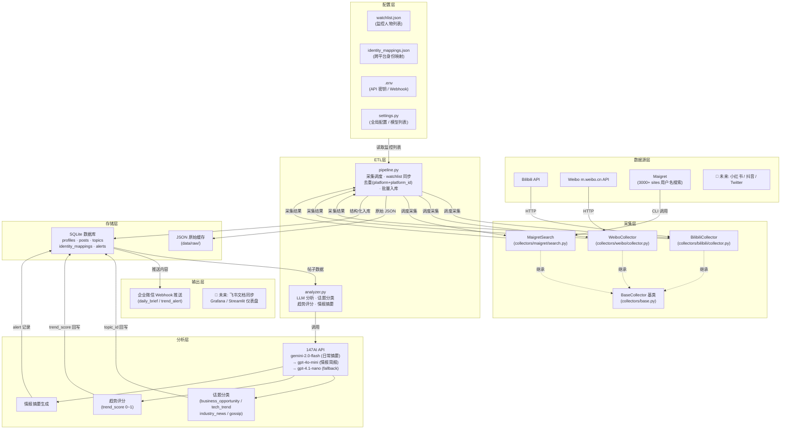
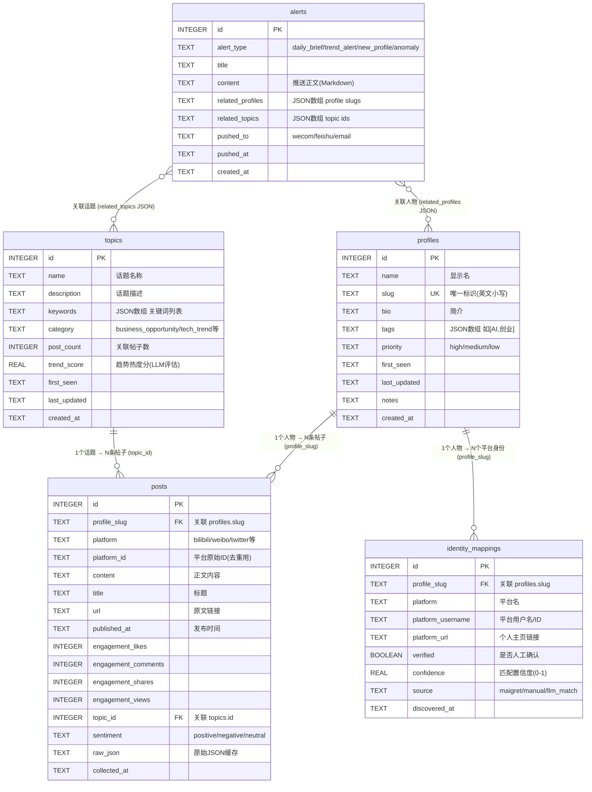

# OSINT Station — 系统架构

## 1. 系统架构图

```mermaid
flowchart TD
    subgraph 数据源层
        B_API["Bilibili API"]
        W_API["Weibo m.weibo.cn API"]
        M_API["Maigret<br/>(3000+ sites 用户名搜索)"]
        FUTURE_SRC["🔮 未来: 小红书 / 抖音 / Twitter"]
    end

    subgraph 采集层
        BASE["BaseCollector 基类<br/>(collectors/base.py)"]
        BC["BilibiliCollector<br/>(collectors/bilibili/collector.py)"]
        WC["WeiboCollector<br/>(collectors/weibo/collector.py)"]
        MC["MaigretSearch<br/>(collectors/maigret/search.py)"]
        BC -.->|继承| BASE
        WC -.->|继承| BASE
        MC -.->|继承| BASE
    end

    subgraph 配置层
        WL["watchlist.json<br/>(监控人物列表)"]
        IM["identity_mappings.json<br/>(跨平台身份映射)"]
        ENV[".env<br/>(API 密钥 / Webhook)"]
        SETTINGS["settings.py<br/>(全局配置 / 模型列表)"]
    end

    subgraph ETL层
        PIPE["pipeline.py<br/>采集调度 · watchlist 同步<br/>去重(platform+platform_id) · 批量入库"]
        SUMM["analyzer.py<br/>LLM 分析 · 话题分类<br/>趋势评分 · 情报摘要"]
    end

    subgraph 存储层
        DB["SQLite 数据库<br/>profiles · posts · topics<br/>identity_mappings · alerts"]
        RAW["JSON 原始缓存<br/>(data/raw/)"]
    end

    subgraph 分析层
        LLM["147AI API<br/>gemini-2.0-flash (日常摘要)<br/>→ gpt-4o-mini (情报简报)<br/>→ gpt-4.1-nano (fallback)"]
        TOPIC["话题分类<br/>(business_opportunity / tech_trend<br/>industry_news / gossip)"]
        TREND["趋势评分<br/>(trend_score 0~1)"]
        BRIEF["情报摘要生成"]
    end

    subgraph 输出层
        WECOM["企业微信 Webhook 推送<br/>(daily_brief / trend_alert)"]
        FUTURE_OUT["🔮 未来: 飞书文档同步<br/>Grafana / Streamlit 仪表盘"]
    end

    %% ── 数据流 ──
    B_API -->|HTTP| BC
    W_API -->|HTTP| WC
    M_API -->|CLI 调用| MC

    配置层 -->|读取监控列表| PIPE
    PIPE -->|调度采集| BC
    PIPE -->|调度采集| WC
    PIPE -->|调度采集| MC

    BC -->|采集结果| PIPE
    WC -->|采集结果| PIPE
    MC -->|采集结果| PIPE

    PIPE -->|原始 JSON| RAW
    PIPE -->|结构化入库| DB

    DB -->|帖子数据| SUMM
    SUMM -->|调用| LLM
    LLM --> TOPIC
    LLM --> TREND
    LLM --> BRIEF

    TOPIC -->|topic_id 回写| DB
    TREND -->|trend_score 回写| DB
    BRIEF -->|alert 记录| DB

    DB -->|推送内容| WECOM
```

## 2. 数据模型 ER 图

```mermaid
erDiagram
    profiles {
        INTEGER id PK
        TEXT name "显示名"
        TEXT slug UK "唯一标识(英文小写)"
        TEXT bio "简介"
        TEXT tags "JSON数组 如[AI,创业]"
        TEXT priority "high/medium/low"
        TEXT first_seen
        TEXT last_updated
        TEXT notes
        TEXT created_at
    }

    posts {
        INTEGER id PK
        TEXT profile_slug FK "关联 profiles.slug"
        TEXT platform "bilibili/weibo/twitter等"
        TEXT platform_id "平台原始ID(去重用)"
        TEXT content "正文内容"
        TEXT title "标题"
        TEXT url "原文链接"
        TEXT published_at "发布时间"
        INTEGER engagement_likes
        INTEGER engagement_comments
        INTEGER engagement_shares
        INTEGER engagement_views
        INTEGER topic_id FK "关联 topics.id"
        TEXT sentiment "positive/negative/neutral"
        TEXT raw_json "原始JSON缓存"
        TEXT collected_at
    }

    topics {
        INTEGER id PK
        TEXT name "话题名称"
        TEXT description "话题描述"
        TEXT keywords "JSON数组 关键词列表"
        TEXT category "business_opportunity/tech_trend等"
        INTEGER post_count "关联帖子数"
        REAL trend_score "趋势热度分(LLM评估)"
        TEXT first_seen
        TEXT last_updated
        TEXT created_at
    }

    identity_mappings {
        INTEGER id PK
        TEXT profile_slug FK "关联 profiles.slug"
        TEXT platform "平台名"
        TEXT platform_username "平台用户名/ID"
        TEXT platform_url "个人主页链接"
        BOOLEAN verified "是否人工确认"
        REAL confidence "匹配置信度(0-1)"
        TEXT source "maigret/manual/llm_match"
        TEXT discovered_at
    }

    alerts {
        INTEGER id PK
        TEXT alert_type "daily_brief/trend_alert/new_profile/anomaly"
        TEXT title
        TEXT content "推送正文(Markdown)"
        TEXT related_profiles "JSON数组 profile slugs"
        TEXT related_topics "JSON数组 topic ids"
        TEXT pushed_to "wecom/feishu/email"
        TEXT pushed_at
        TEXT created_at
    }

    profiles ||--o{ posts : "1个人物 → N条帖子 (profile_slug)"
    profiles ||--o{ identity_mappings : "1个人物 → N个平台身份 (profile_slug)"
    topics ||--o{ posts : "1个话题 → N条帖子 (topic_id)"
    alerts }o--o{ profiles : "关联人物 (related_profiles JSON)"
    alerts }o--o{ topics : "关联话题 (related_topics JSON)"
```

---

> **说明**：标注 🔮 的组件为规划中的未来扩展，当前版本未实现。
